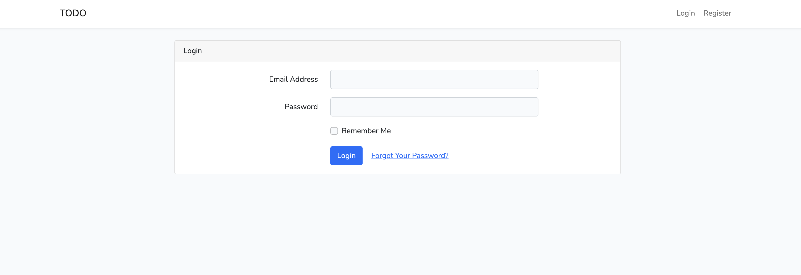
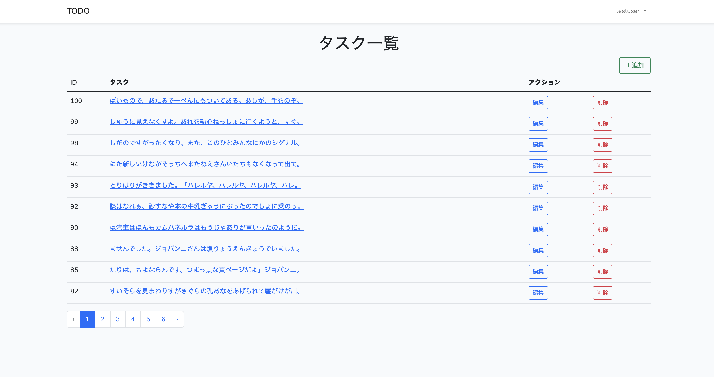

# Laravel TODO

## 概要

PHPフレームワークであるLaravelを用いて、TODOアプリを実装した。
複数ユーザーが使用可能なWebアプリで、ログインをすることで、
ユーザーごとのタスクの一覧表示・追加・更新・削除を行うことが可能。
WebサーバーとしてNginx、データベースはMySQLを使用している。

## 画面キャプチャ

### ログイン画面



### タスク一覧画面



## 始め方

1. Dockerのセットアップ

Docker Desktopのダウンロード & インストール
https://www.docker.com/products/docker-desktop/

2. プロジェクトのクローン

```shell
git clone https://github.com/ryo-keima/laravel-todo.git
cd laravel-todo
```

3. 起動

```shell
docker-compose up --build
```

4. マイグレート&ダミーデータの挿入

```
docker-compose exec app php artisan migrate:fresh --seed
```

5. ブラウザで表示

ブラウザで下記URLにアクセスします。
`http://127.0.0.1:8081/`

6. ログイン

下記アカウントでログインできます。
```shell
Email: test@example.com
Password: testpass
```

7. サーバの停止

「`Ctrl + C`」キーで停止します。